# Trabalho de GeoModelagem e Visão Computacional - Açaí e Barbeiro

Este repositório contém o desenvolvimento prático da análise integrada da produção de açaí no Estado do Pará, combinando geoprocessamento, dados meteorológicos, modelagem espacial e visão computacional.

## 🎓 Informações Acadêmicas
* **Instituição:** Universidade Estadual do Norte Fluminense Darcy Ribeiro (UENF)
* **Laboratório:** LAMET - Laboratório de Meteorologia
* **Programa:** Mestrado em Clima e Energia
* **Disciplina:** GeoModelagem do Potencial Energético e do Microclima Urbano
* **Professora:** Dra. Raquel Jahara Lobosco
* **Desenvolvido em Dupla por:** * Letícia Raquel Trindade Gonçalves
  * Rafael de Oliveira Menezes

---

## 🗺️ Parte 1 – Mapeamento Climático

[Clique aqui para abrir o Notebook da Parte 1](Parte1GeoModelagem.ipynb)
Nesta etapa, criamos os mapas climáticos sazonais do Estado do Pará utilizando a biblioteca `Cartopy` em Python, destacando a principal região produtora de açaí (Igarapé-Miri, Cametá, Abaetetuba e entorno). 

Foram processados dados meteorológicos da base Copernicus (`ERA5`/`ERA5-Land`) referentes ao ano de 2024 (horário das 15h). Abaixo estão os 16 mapas gerados, organizados por variável atmosférica e estação do ano:

### 🌧️ Precipitação ou Índice Pluviométrico
| Verão | Outono | Inverno | Primavera |
| :---: | :---: | :---: | :---: |
| 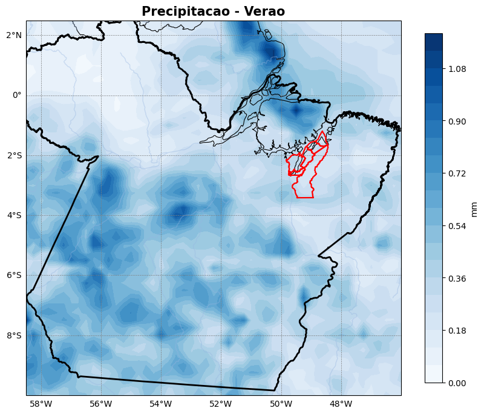 | 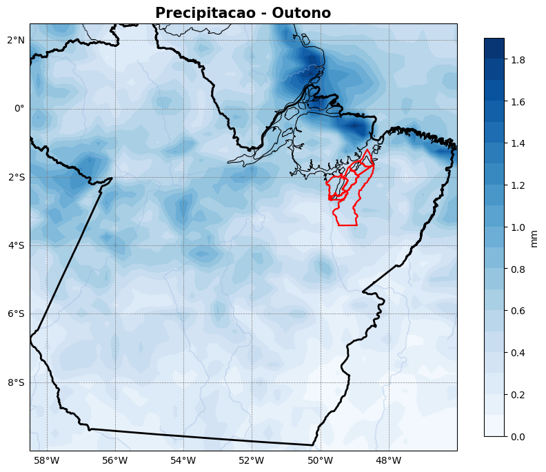 | 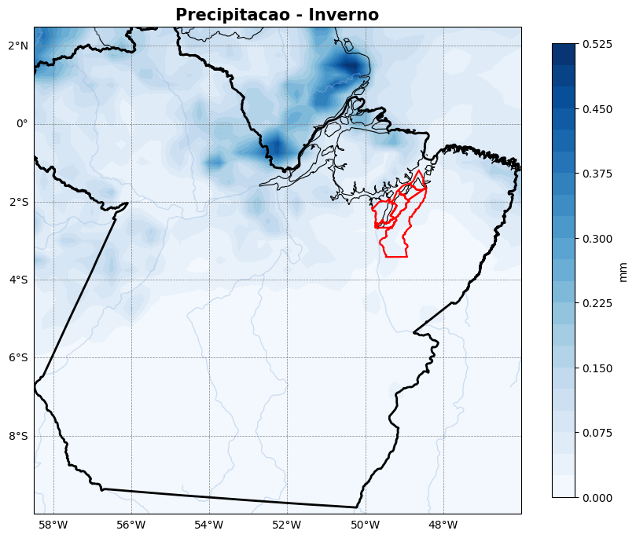 | 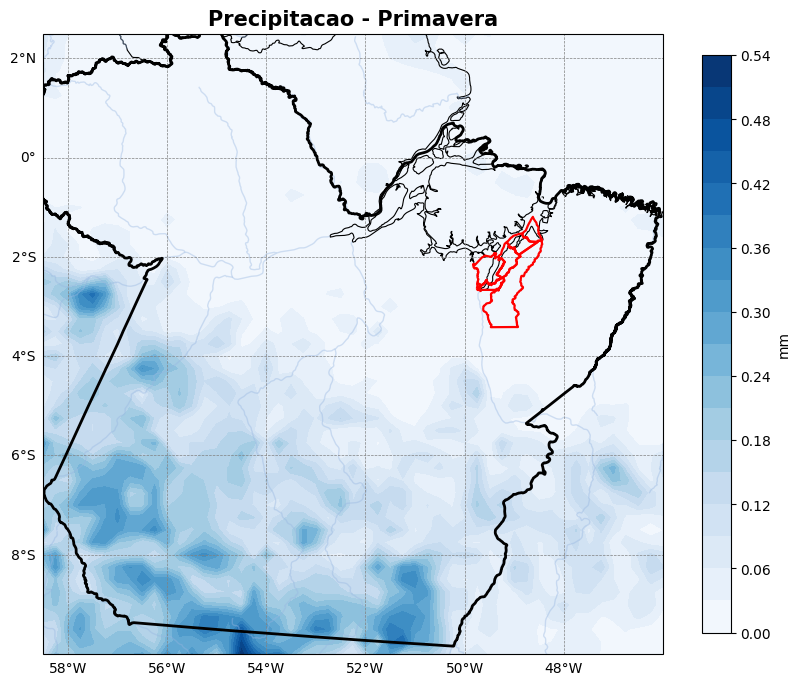 |

### 🌡️ Temperatura do Ar (ºC)
| Verão | Outono | Inverno | Primavera |
| :---: | :---: | :---: | :---: |
| 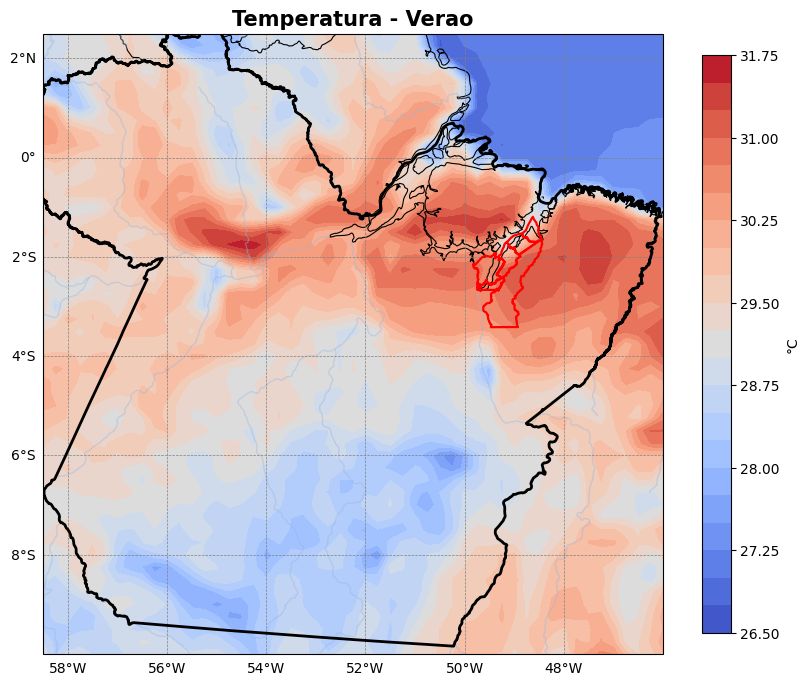 | 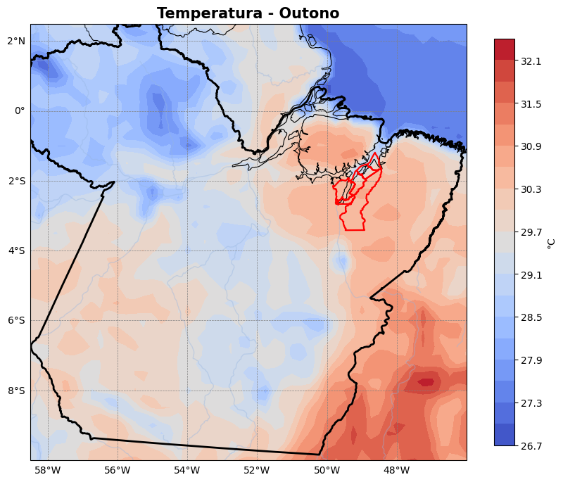 | 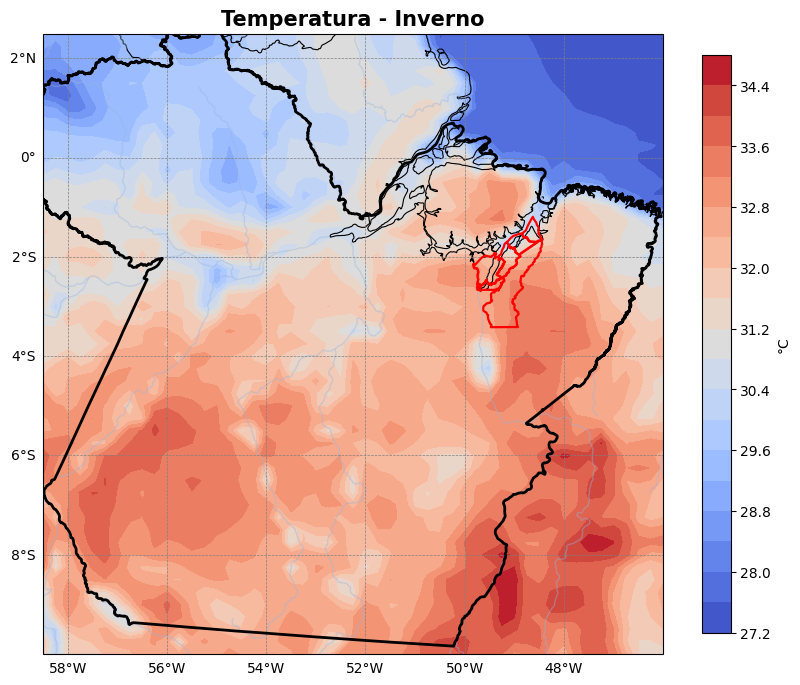 | 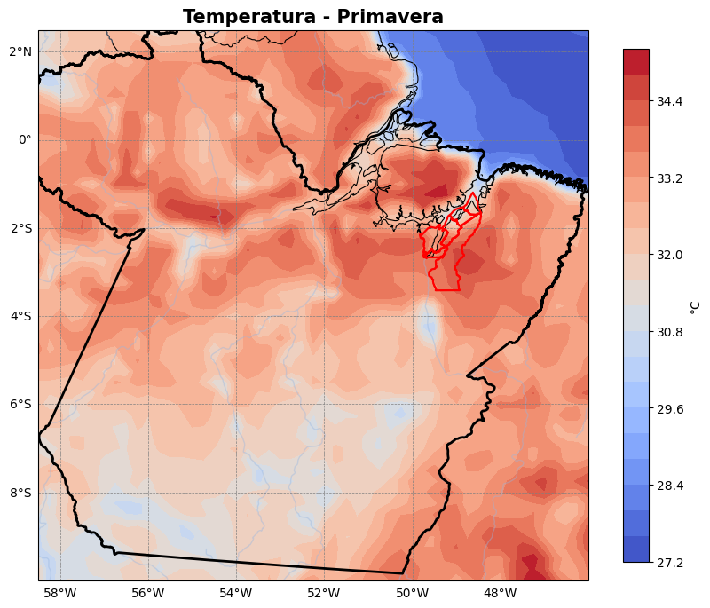 |

### 💨 Intensidade do Vento (m/s)
| Verão | Outono | Inverno | Primavera |
| :---: | :---: | :---: | :---: |
| 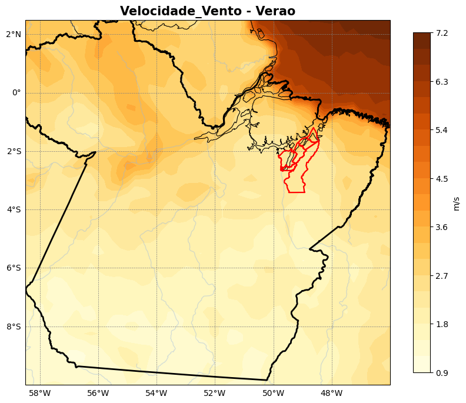 | 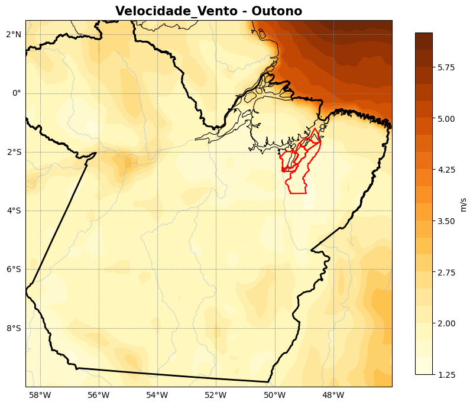 | 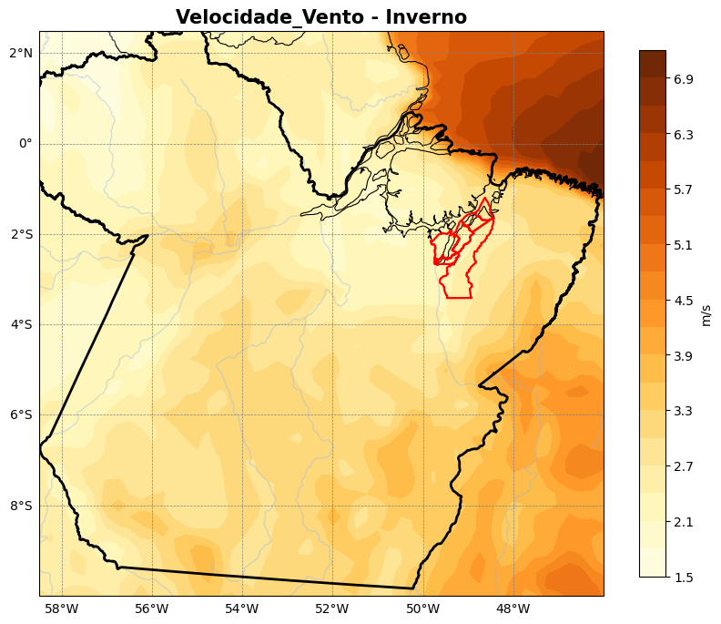 | 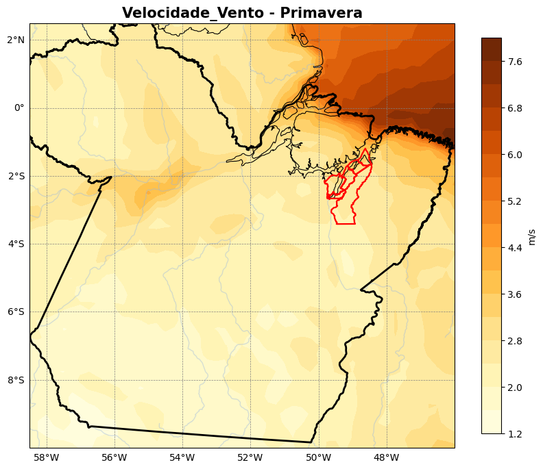 |

### 💧 Umidade Específica (kg/kg)
| Verão | Outono | Inverno | Primavera |
| :---: | :---: | :---: | :---: |
| 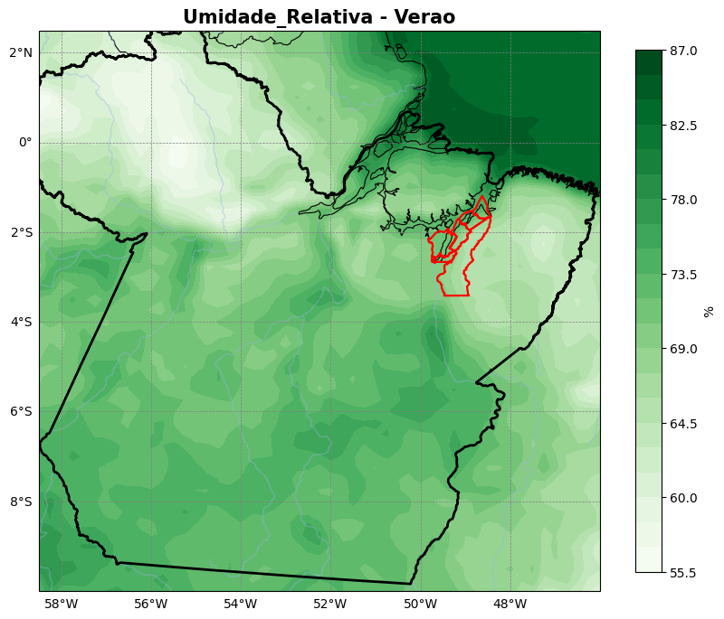 | 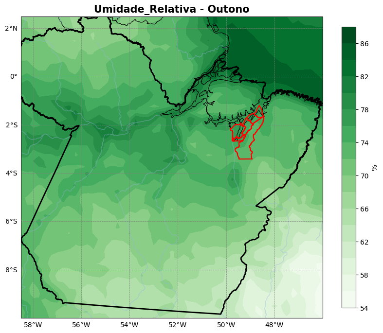 | 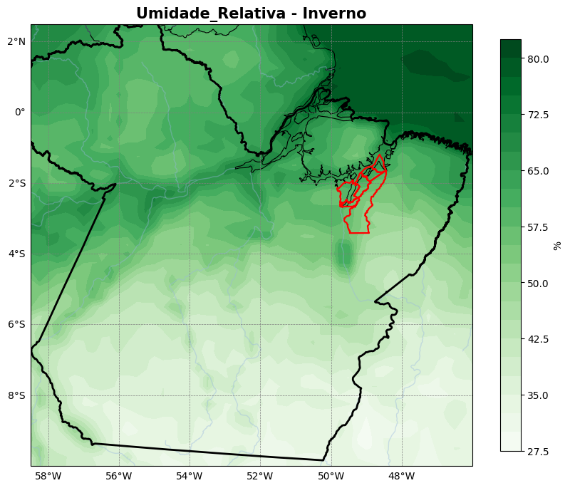 | 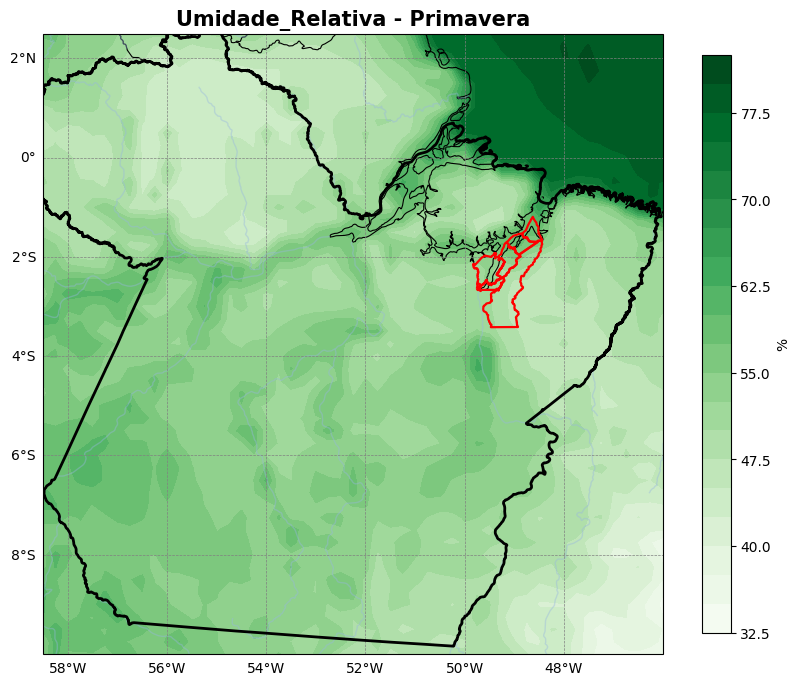 |

---

## 👁️ Parte 2 – Visão Computacional com YOLO
Aplicação de visão computacional utilizando a biblioteca `YOLO/Ultralytics` para detectar elementos associados à produção de açaí e ao risco sanitário. O modelo foi treinado para realizar a detecção visual do inseto vetor (*barbeiro/triatomíneo*) e das estruturas do fruto (*acai*, *cacho*).

[Clique aqui para abrir o Notebook da Parte 2](acaibarbeiro.ipynb)
---

## 📊 Parte 3 – Análise Integrada entre Clima e Production de Açaí

Abaixo apresenta-se a tabela comparativa e o gráfico correlacionando os dados meteorológicos do Copernicus com os aspectos ecológicos e biológicos observados na região produtora de Igarapé-Miri, Abaetetuba e Cametá.

### 📈 Tabela Comparativa Sazonal

| Estação | Precipitação | Temperatura | Umidade | Vento | Índice de produção (qualitativo)* |
| :--- | :--- | :--- | :--- | :--- | :--- |
| **Verão** | Alta/moderada | Amena | Alta | Elevado (costa) | Baixo–moderado |
| **Outono** | Moderada | Mais baixa do ano | Alta | Moderado | Baixo |
| **Inverno** | Mínima do ano | Elevada | Mínima relativa | Fraco (costa) | Alto (pico de safra) |
| **Primavera** | Retomada | Máxima do ano | Mínima do ano | Máximo do ano | Moderado–alto |

### 📉 Gráfico de Correlação Sazonal

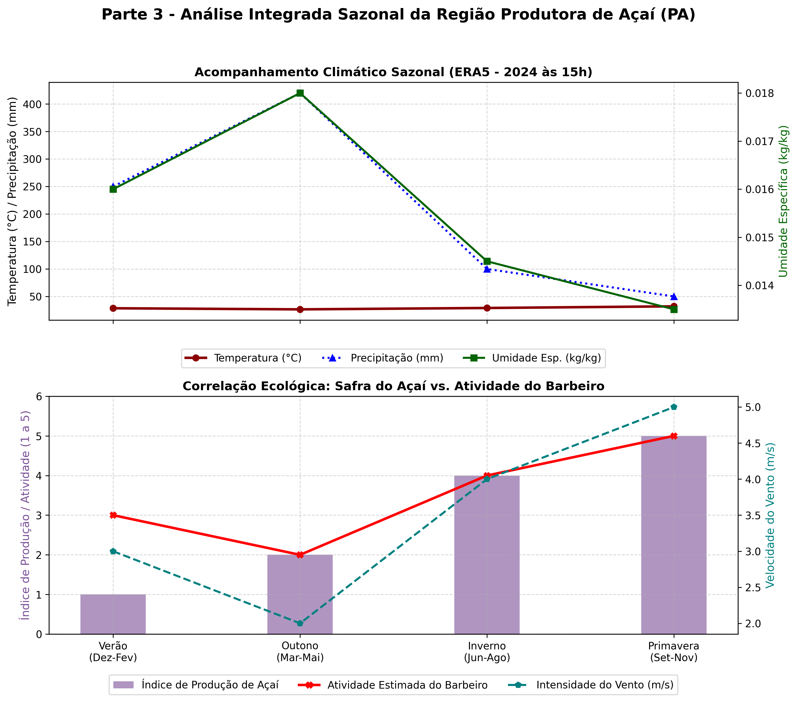
